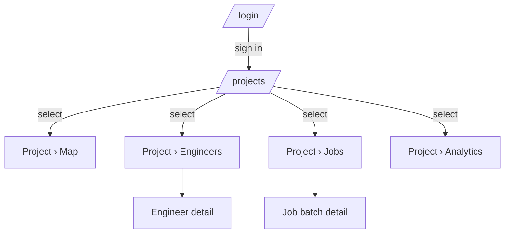

# Workflow 01 — map the current navigation

Goal: produce a concrete, file-referenced picture of how the app navigates today. No criticism yet — that's workflow 02.

## Steps

### 1. Locate the entry point

- Single-page apps: find the root HTML and JS entry (look for `index.html`, `main.tsx`, `App.vue`, etc.).
- Multi-page apps: find the server routes that serve pages.
- Confirm the framework (or lack thereof) and any router library in use.

### 2. List every route / view

Build a flat list:

```
- /                       (login overlay, if no session)
- /projects               (project picker overlay)
- in-app section: Map
- in-app section: Engineers
- in-app section: Jobs
- in-app section: Analytics
- modal: Create project
- modal: Project settings
- modal: Preflight run config
- …
```

Note for each:
- The file/line where it's defined.
- How it's reached (URL? button onclick? deep link?).
- Whether it has a unique URL.
- What state must exist before reaching it (signed in? project selected?).

### 3. Find the shell

What persistent UI is wrapped around the routes?

- Header / top bar — file, lines.
- Side rail / nav — file, lines.
- Footer — file, lines.
- Persistent modals / drawers / panels.

For each, list:
- Components rendered (logo, project chip, section nav, avatar menu, etc.).
- Which are present today, which are missing.

### 4. Map the state model

- Where does the app track "current project"? "current section"? "current user"?
- Global variables, in-memory store, URL parameters, local storage, server session?
- How are these synced with the URL (if at all)?

### 5. Find the modals

For each modal:
- File:line.
- Trigger (button onclick? route? programmatic?).
- ARIA attributes present (role, aria-modal, labelledby).
- Close affordances (×, ESC, backdrop).
- Z-index.
- Focus management on open and close.

### 6. Produce the route map

Either as a Mermaid diagram:



Or as an indented list. Save to the audit doc.

### 7. Produce the state map

A second diagram or table showing where state lives:

```
| State           | Type     | Location           | URL-synced? |
|-----------------|----------|--------------------|-------------|
| signed-in user  | session  | Supabase JWT       | n/a         |
| current project | variable | app.js:56          | NO          |
| current section | CSS class| .app-view.active   | NO          |
| open modal      | DOM      | .modal-overlay     | NO          |
```

### 8. Note the obvious smells (don't critique yet, just flag)

Things you noticed but will analyze in workflow 02:

- Five overlays with hardcoded z-indexes.
- No router.
- Onclick handlers for view switching.
- Etc.

## Deliverable

A markdown section titled "Current state" with:

- App stack (one paragraph).
- Route list (table or list).
- Shell inventory (table).
- State map (table).
- Mermaid diagram or indented list of the IA.
- File:line references throughout, in markdown link form.

Aim for 600–1500 words. Concrete, not interpretive.
