# InView VROOM — System Documentation

> A guide to the VROOM Route Optimisation Engine
>
> **Version:** 1.0 · **Date:** March 2026

---

## 1. What Does This System Do?

InView VROOM automatically plans the most efficient daily schedule for field engineers. You give it a list of engineers and a list of jobs, and it works out the **best order to visit each job** so that driving time is minimised, nobody works overtime, and every job is matched to someone with the right skills.

It also takes **real-world traffic** into account — routes planned for rush hour will be different from routes planned for midday.

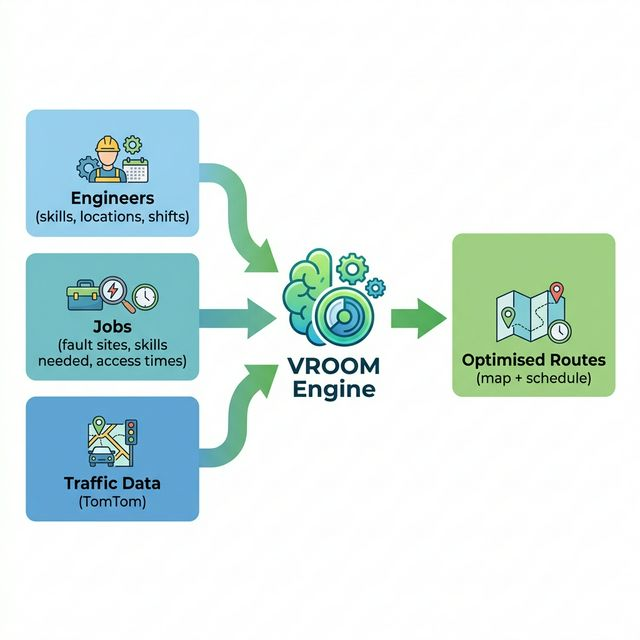

---

## 2. How It Works — The Four Stages

Data flows through four stages in sequence. Each stage takes the output of the previous one and refines it further.

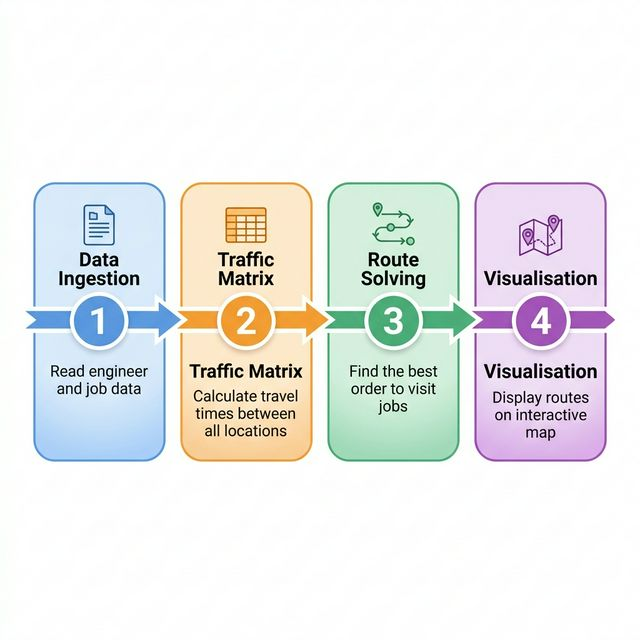

**Stage 1 — Data Ingestion:** Reads engineer and job files, standardises skills, locations, and time windows.

**Stage 2 — Traffic Matrix:** Calculates how long it takes to drive between every pair of locations at the relevant time of day. The result is a grid of travel times.

**Stage 3 — Route Solving:** The VROOM solver takes the travel time grid and all the constraints (skills, shift hours, site access windows) and finds the optimal route for each engineer.

**Stage 4 — Visualisation:** Routes are converted into map data and displayed on an interactive map with activity timelines.

---

## 3. Engineers, Jobs, and Skill Matching

The system needs two sets of information to work: **who is available** (engineers) and **what needs doing** (jobs). Both are defined with specific attributes that the solver uses to make optimal assignments.

### How Engineer Profiles Are Built

Each engineer is defined with a starting location (their depot), a set of professional skills, and their working hours. Engineers start and end their day at the same location.

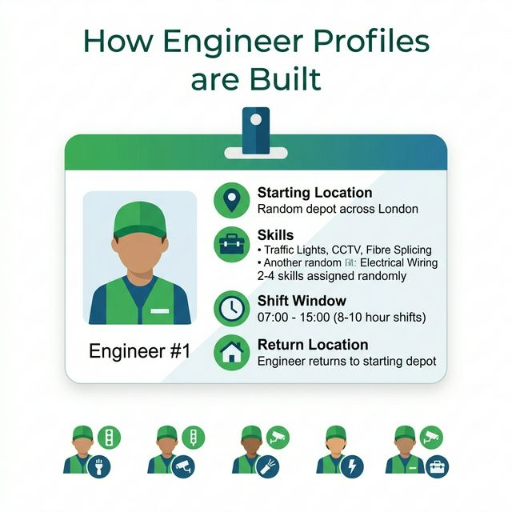

The system currently supports six skill categories:

| Skill | Description |
|---|---|
| Traffic Light Repair | Fault diagnosis and repair of signal controllers |
| CCTV Maintenance | Camera and column servicing |
| Fibre Splicing | Fibre optic cable joining and testing |
| High Voltage | Switchgear inspection and high-voltage work |
| Sign Installation | Road sign fitting and replacement |
| Road Marking | Lane marking and surface treatment |

Each engineer is assigned **2 to 4 skills** from this list. Their shift starts around 07:00 (with slight staggering) and runs for 8 to 10 hours.

### How Job Requirements Are Built

Each job represents a fault or task at a specific location. Jobs carry skill requirements, a priority level, and an estimated on-site service time.

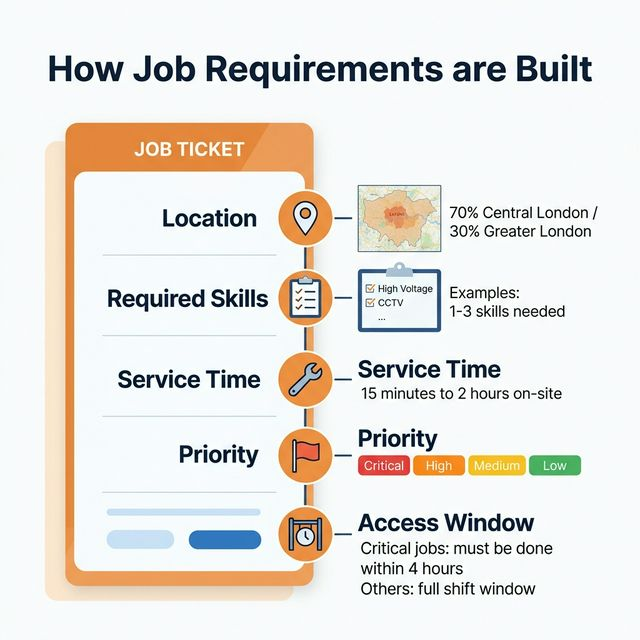

Jobs are distributed across London with a **70% bias toward Central London**, reflecting realistic fault density. Service times range from 15 minutes to 2 hours depending on the type of work.

Priority determines urgency:

| Priority Level | Time Constraint |
|---|---|
| **Critical** | Must be completed within 4 hours of shift start |
| **High** | Full shift window |
| **Medium** | Full shift window |
| **Low** | Full shift window |

### How Skill Matching Works

The solver treats skills as a **hard constraint** — a job can only be assigned to an engineer who has **all** of that job's required skills. If no engineer has the right combination, the job is flagged as unassigned.

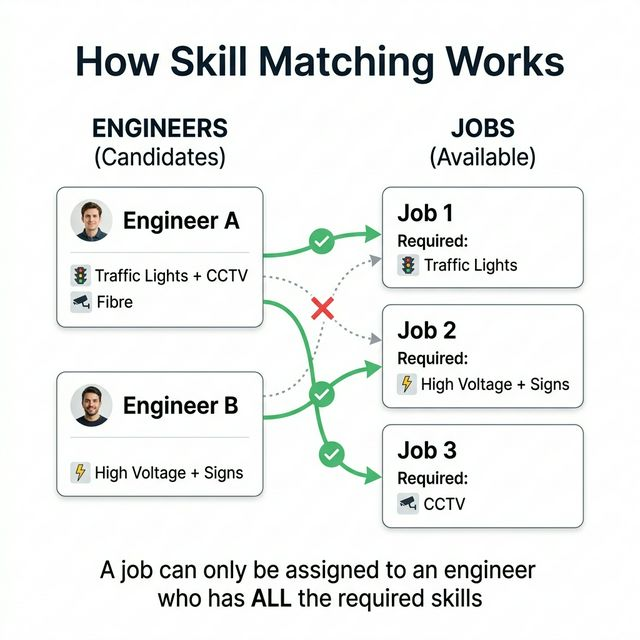

---

## 4. The Three Routing Strategies

The system offers three levels of accuracy. You choose the right one depending on whether you need speed, cost savings, or maximum realism.

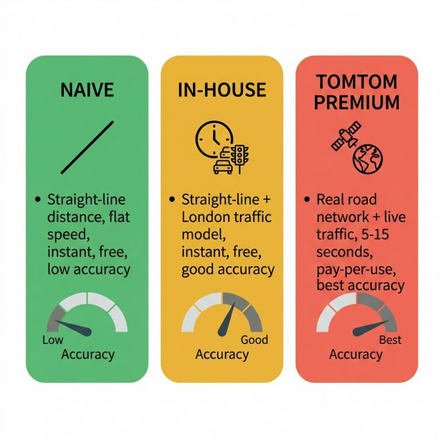

### Naive (Free, instant)

Uses straight-line distance divided by a flat 30 km/h. Ignores roads and traffic entirely. Good for quick testing.

### In-House (Free, instant, realistic)

Uses straight-line distance adjusted by a built-in London traffic model. This model accounts for time of day and geographic zone.

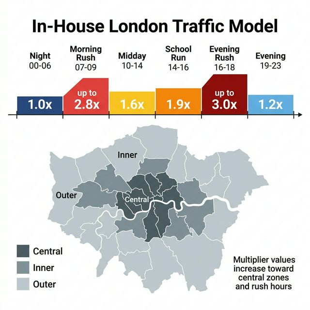

A trip through Central London during morning rush gets its travel time multiplied by 2.8×, while the same trip at midnight stays at 1.0× (no traffic delay). The model covers six time periods and three geographic zones (Central, Inner, and Outer London).

### TomTom Premium (Paid, most accurate)

Uses real-world road data and predictive traffic from TomTom. Also triggers the iterative refinement loop described in the next section.

---

## 5. The Iterative Convergence Loop

When using TomTom Premium, the system doesn't just calculate routes once — it **refines them in a loop** to handle the fact that traffic changes throughout the day.

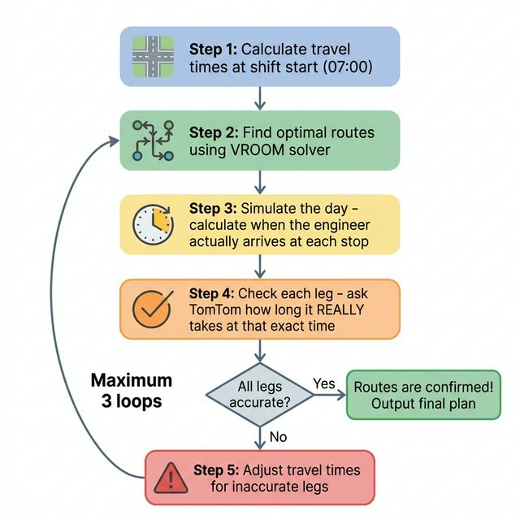

### Why is this needed?

Imagine a shift starting at 07:00. The initial travel times are based on 07:00 traffic. But by the time the engineer reaches their third job at 10:30, traffic has changed — the 07:00 estimates may no longer be accurate.

### How it works

1. **Calculate** travel times at shift start (07:00)
2. **Solve** the best routes using those travel times
3. **Simulate** the day forward to figure out *when* the engineer actually departs for each leg
4. **Check** each leg — ask TomTom "how long does this leg really take at **that exact time**?"
5. If any leg is off by more than 25%, **adjust** the travel times and go back to step 2
6. If all legs are accurate (or 3 loops have been completed), **output the final plan**

### Central London Ring Fence

Before the loop starts, any job located inside Central London is automatically restricted to **non-peak hours only** (10:00–15:30). This prevents the solver from sending engineers into the city centre during rush hour.

---

## 6. The Simulation Sandbox

The Sandbox is a web-based testing tool where you can create, run, and compare routing scenarios visually.

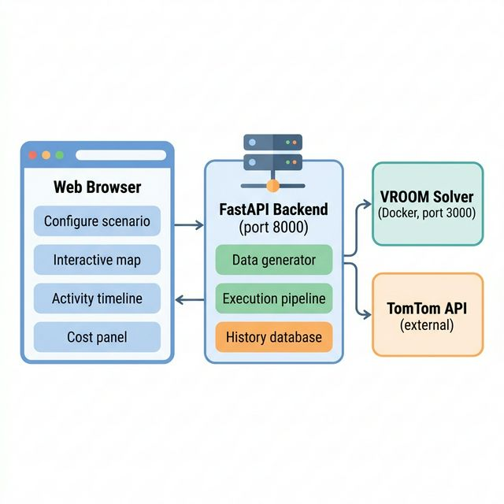

### What you can do

- **Generate scenarios** — Create random jobs and engineers across London
- **Compare strategies** — Run the same scenario with Naive, In-House, and TomTom side by side
- **Remix** — Re-run a previous test with a different strategy while keeping the same job assignments
- **Watch animated playback** — See engineers move along their routes on the map
- **View activity logs** — See a chronological breakdown of each engineer's day
- **Browse history** — All past runs are saved and can be replayed

---

## 7. Cost-Saving Strategies

When using TomTom Premium, the system has four built-in techniques to minimise the number of paid API calls.

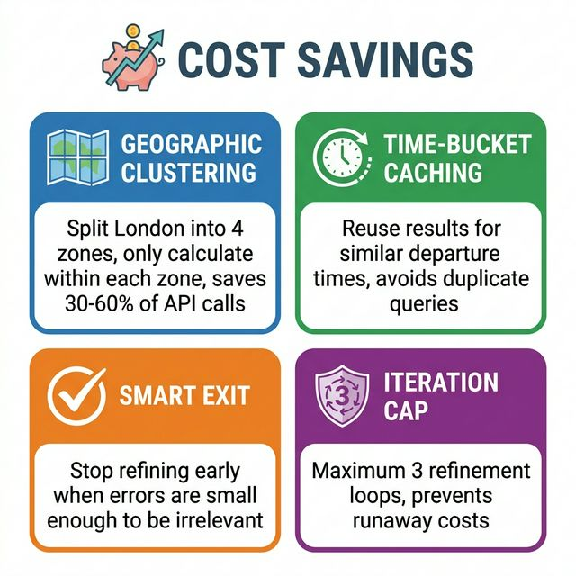

**Geographic Clustering** — Instead of computing travel times between every possible pair, London is split into four overlapping zones. Only pairs within the same zone are computed. This typically saves 30–60% of API calls.

**Time-Bucket Caching** — Departure times are rounded to the nearest 10 minutes. If the same leg is queried within the same 10-minute window, the cached result is reused.

**Smart Exit** — The refinement loop stops early if the remaining errors are too small to matter.

**Iteration Cap** — A hard limit of 3 loop iterations prevents costs from growing unexpectedly.

---

## 8. TomTom API Pricing

TomTom charges on a **pay-as-you-go** basis with a free daily allowance.

### Free Tier

| Resource | Free Daily Limit |
|---|---|
| Map tile requests | 50,000 per day |
| Routing / Matrix requests | 2,500 per day |

### Paid Pricing (beyond the free tier)

| API | Cost per 1,000 Requests |
|---|---|
| Routing API (single route) | **€0.75** |
| Matrix Routing API (bulk grid) | **€2.50** |

### What does a typical run cost?

| Scenario | Team Size | Estimated Cost |
|---|---|---|
| Small test | 3 engineers + 7 jobs | ~€0.04 |
| Typical day | 5 engineers + 20 jobs | ~€0.26 |
| Large team | 5 engineers + 50 jobs | ~€1.27 |
| Stress test | 5 engineers + 70 jobs | ~€2.36 |

These are for the initial matrix calculation only. Each convergence iteration adds a small number of extra routing calls. A full run is typically **under €5**.

---

## 9. Future Roadmap — Valhalla + INRIX

The current system relies on TomTom's cloud API for real-world traffic data. While accurate, every query costs money. A future upgrade would replace TomTom with a **self-hosted routing engine** called **Valhalla**, paired with traffic data from **INRIX**. This would provide the same (or better) accuracy with **no per-query costs**.

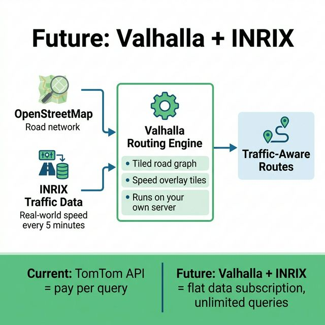

### What is Valhalla?

Valhalla is a free, open-source routing engine built by the mapping community. Like TomTom, it can calculate driving routes, travel times, and turn-by-turn directions — but it runs entirely on your own server. It uses **OpenStreetMap** for its road network and stores everything in a compact, tiled structure that loads quickly.

### What is INRIX?

INRIX is a traffic data company that collects speed and congestion information from millions of connected vehicles and mobile devices. They sell this data as a subscription — you pay a flat fee for access to their traffic feed, rather than paying per query like TomTom.

### How Speed Tiles Work

The key difference from TomTom is how Valhalla handles traffic. Instead of asking a cloud API "how long does this road take right now?" each time, Valhalla pre-loads traffic speed data directly into its road map using **speed tiles**.

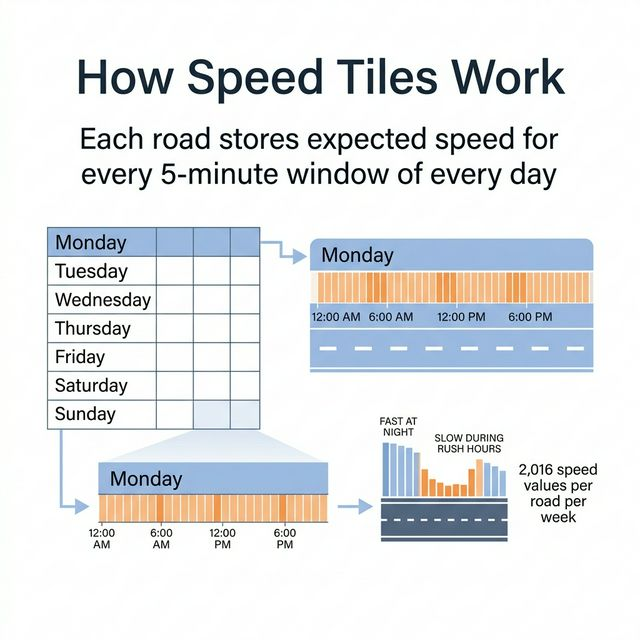

With INRIX configured at **5-minute intervals**, every road segment in the network stores a speed profile covering the entire week — that's **2,016 speed values per road** (7 days × 288 five-minute windows per day). When calculating a route, Valhalla looks up the expected speed for each road at the *exact* time the driver would be on it, just like TomTom does — but without making any external API call.

### Why This Matters

| Aspect | TomTom (Current) | Valhalla + INRIX (Future) |
|---|---|---|
| **Traffic accuracy** | High — predictive cloud model | High — 5-minute interval profiles from real vehicle data |
| **Road network** | TomTom proprietary | OpenStreetMap (free, community-maintained) |
| **Per-query cost** | €0.75–2.50 per 1,000 queries | **Zero** — all queries are local |
| **Data cost** | Included in query price | Flat INRIX subscription |
| **Speed** | Network latency to TomTom cloud | Local computation — faster for large matrices |
| **Convergence loop** | Each verification leg costs an API call | Unlimited verification — no extra cost |
| **Offline capability** | Requires internet | Works fully offline once data is loaded |

With Valhalla, the convergence loop becomes essentially free to run — the system could iterate as many times as needed without worrying about API costs.

The transition would be seamless for the rest of the system. Valhalla produces the same outputs (travel time matrices, route geometries) as TomTom, so the VROOM solver, visualisation, and sandbox would all continue to work unchanged.

---

## 10. Glossary

| Term | Plain English |
|---|---|
| **VROOM** | The open-source software that finds the best routes |
| **Valhalla** | A free, open-source routing engine that can run on your own server |
| **INRIX** | A traffic data provider that sells speed and congestion data as a subscription |
| **Matrix** | A grid showing travel times between every pair of locations |
| **Speed Tiles** | Pre-loaded traffic speed data embedded directly into Valhalla's road map |
| **Convergence** | The process of refining routes until they are stable |
| **GeoJSON** | A standard format for showing routes and points on a map |
| **TomTom** | The external mapping and traffic data provider currently used |
| **Free Flow** | Driving with no traffic — the fastest possible journey |
| **Multiplier** | How much longer a trip takes due to traffic (e.g. 2.0× = twice as long) |
| **Ring Fence** | A geographic boundary controlling when Central London jobs can be serviced |
| **OpenStreetMap** | A free, community-maintained map of the world's roads and features |
| **Docker** | Software that packages applications into portable, self-contained containers |

---

*InView VROOM System Documentation · Version 1.0 · March 2026*
